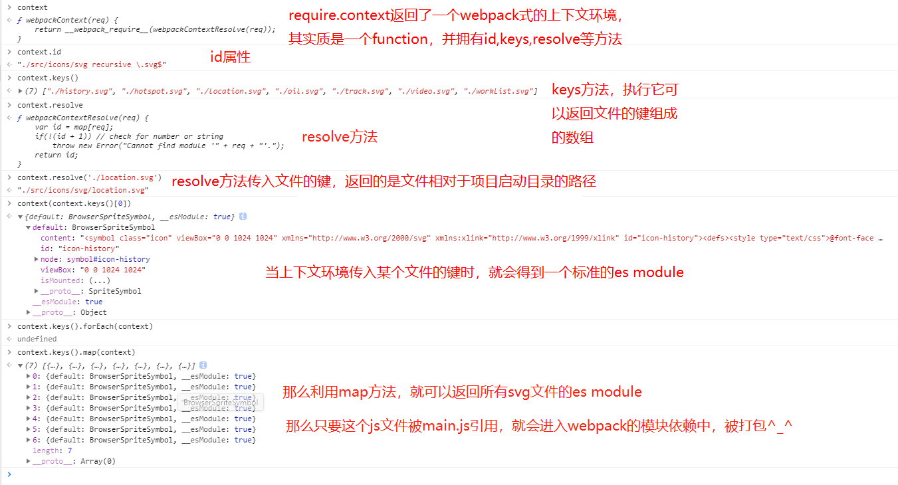

2023 年 6 月 1 日，TypeScript5.1 正式发布了。新版本中新增了几个功能，一会儿带大家一起了解一下。
你可以通过以下命令进行安装新版本

```
npm install typescript@beta
```

新版本中新增了以下主要功能：

- 改进函数返回值类型 undefined 的类型推断
- getter 和 setter 支持设置不同类型
- JSX 元素和 JSX 标签类型之间解耦类型检查
- 带命名空间的 JSX 标签
- typeRoots 在模块解析中被查询
- JSX 标签支持链接光标
- @Param JSDoc 标签中支持代码补全
- 优化
  接下来我们就一起来了解一下新增的功能。

# 「一、改进函数返回值类型 undefined 的类型推断」

在 JavaScript 中，如果函数没有返回值，就会返回 undefined，如下所示：

```
function foo() {
  // 没有 return
}
// x = undefined
let x = foo()
```

在以前版本的 TypeScript 中，只有返回值类型为 void 和 any 的函数可以没有 return 语句。这意味着，即使明确知道这个函数是返回 undefined 的，也需要至少有一个 return 语句。如下所示：

```
// ✅ 推断 f1 返回 void
function f1() {
  // no returns
}

// ✅ void 不需要 return 语句
function f2(): void {
  // no returns
}

//  ✅ any 不需要 return 语句
function f3(): any {
  // no returns
}

// ❌ 声明类型既不是 void 也不是 any 的函数必须返回一个值。
function f4(): undefined {
  // no returns
}
```

我们有时候可能会希望函数返回 undefined 。在之前的版本中，可能需要显式返回一个 undefined 或者显式添加一个 return 语句。如下所示：

```
declare function takesFunction(f: () => undefined): undefined

// ❌ 类型“() => void”的参数不能赋给类型“() => undefined”的参数。不能将类型“void”分配给类型“undefined”。
takesFunction(() => {
  // no returns
})

// ❌ 其声明类型不为 "void" 或 "any" 的函数必须返回值。
takesFunction((): undefined => {
  // no returns
})

// ❌ 类型“() => void”的参数不能赋给类型“() => undefined”的参数。不能将类型“void”分配给类型“undefined”。
takesFunction(() => {
  return
})

// ✅ 显式返回 undefined
takesFunction(() => {
  return undefined
})

// ✅ 显式添加 return 语句
takesFunction((): undefined => {
  return
})
```

在 TypeScript5.1 版本中，就允许返回 undefined 的函数没有 return 语句。如下所示：

```
// ✅
function f4(): undefined {
  // no returns
}

// ✅
takesFunction((): undefined => {
  // no returns
})
```

如果函数没有 return 并且被传递给期望返回 undefined 的函数参数，TypeScript 会推断该函数的返回类型为 undefined。如下所示：

```
// ✅
takesFunction(function f() {
  // ^ 返回值类型为 undefined

  // no returns
})

// ✅
takesFunction(function f() {
  // ^ 返回值类型为 undefined
  return
})
```

为了解决另一个类似的痛点，在 TypeScript 的 --noImplicitReturns 选项下，仅返回 undefined 的函数现在具有与 void 类似的异常，因为并非每个代码路径都必须以显式 return 结束。

```
// ✅ 启用 '--noImplicitReturns'
function f(): undefined {
  if (Math.random()) {
    // ...
    return
  }
}
```

# 「二、getter 和 setter 支持设置不同类型」

在 TypeScript 4.3 版本中， get 和 set 访问器对可以指定两种不同的类型。

```
interface Serializer {
  set value(v: string | number | boolean)
  get value(): string
}

declare let box: Serializer

// 允许赋值为 'boolean'
box.value = true

// 类型为 'string'
console.log(box.value.toUpperCase())
```

刚开始要求 get 类型必须是 set 类型的子类型。如以下写法：

```
box.value = box.value
```

但是也存在现有的和提议的 API 在它们的 getter 和 setter 之间具有完全不相关的类型。
例如，一个最常见的例子——DOM 和 CSSStyleRule API 中的 style 属性。每个样式规则都有一个 style 属性，即 CSSStyleDeclaration；但是，如果尝试写入该属性，它只能使用字符串才有效。
在新版本 TypeScript 5.1 版本中，允许 get 和 set 访问器属性设置不同的类型，前提是它们具有显式类型注释。虽然此版本的 TypeScript 尚未更改这些内置接口的类型，但现在可以通过以下方式定义 CSSStyleRule：

```
interface CSSStyleRule {
    get style(): CSSStyleDeclaration
    set style(newValue: string)
}
```

也允许以下方式使用：

```
class SafeBox {
    #value: string | undefined
    // 只接受字符串
    set value(newValue: string) {

    }
    // 必须检查 undefined
    get value(): string | undefined {
        return this.#value
    }
}
```

这就类似于在 --exactOptionalProperties 下检查可选属性的方式。

# 「三、JSX 元素和 JSX 标签类型之间解耦类型检查」

TypeScript 对 JSX 的一个痛点是它对每个 JSX 元素标签类型的要求。此版本的 TypeScript 使 JSX 库可以更准确地描述 JSX 组件可以返回的内容，这具体意味着可以在 React 中使用异步服务端组件。
例如，有以下 JSX 元素：

```
//  自闭合的 JSX 标签
<Foo />

// 带有开始/结束标签的常规元素
<Bar></Bar>
```

当对 <Foo /> 或 <Bar></Bar> 进行类型检查时，TypeScript 总是会查找名为 JSX 的命名空间，并从中获取一个名为 Element 的类型，也就是在查找 JSX.Element。
但是为了检查 Foo 或 Bar 本身是否是有效的标签名称，TypeScript 会粗略地获取由 Foo 或 Bar 返回或构造的类型，并检查与 JSX.Element 的兼容性（或者如果类型是可构造的，则检查另一种称为 JSX.ElementClass 的类型）。
这个限制意味着如果组件返回比 JSX.Element 更广泛的类型，则无法使用组件。例如，JSX 库可能可以接受一个返回字符串或 Promise 的组件。举一个具体的例子，React 的未来版本提议对返回 Promise 的组件提供有限支持，但是现有版本的 TypeScript 无法表达这种类型，除非彻底放宽 JSX.Element 的类型限制。

```
import * as React from "react"

async function Foo() {
    return <div></div>
}

let element = <Foo />
// “Foo”不能用作 JSX 组件。其返回类型 "Promise<Element>" 不是有效的 JSX 元素。
```

为了向库提供一种表达方式，TypeScript 5.1 现在会查找名为 JSX.ElementType 的类型。ElementType 精确指定什么可以有效用作 JSX 元素中的标签。因此，现在它的类型可能会被定义为类似于以下这样：

```
namespace JSX {
    export type ElementType =
        // 所有有效的小写标签
        keyof IntrinsicAttributes
        // 函数组件
        (props: any) => Element
        // 类组件
        new (props: any) => ElementClass;

    export interface IntrinsictAttributes extends /*...*/ {}
    export type Element = /*...*/;
    export type ClassElement = /*...*/;
}
```

# 「带命名空间的 JSX 标签」

TypeScript 现在支持在使用 JSX 时使用带命名空间的属性名。

```
import * as React from "react"

// 这两个是等价的：
const x = <Foo a:b="hello" />
const y = <Foo a : b="hello" />

interface FooProps {
    "a:b": string
}

function Foo(props: FooProps) {
    return <div>{props["a:b"]}</div>
}
```

当名称的第一部分是小写字母时，在 JSX.IntrinsicAttributes 上以类似的方式查找命名空间标签名称。

```
// 在某些库的代码中或在该库的扩展中：
namespace JSX {
    interface IntrinsicElements {
        ["a:b"]: { prop: string }
    }
}

// 在我们的代码中：
let x = <a:b prop="hello!" />
```

# 「typeRoots 在模块解析中被查询」

当 TypeScript 指定的模块查找策略无法解析路径时，它现在将解析相对于指定 typeRoots 的包。

# 「JSX 标签支持链接光标」

TypeScript 现在支持 JSX 标签名称的链接编辑。也就是在编辑开始/结束标签时，会自动修改结束/开始标签。

这项新功能应该适用于 TypeScript 和 JavaScript 文件，并且可以在 Visual Studio Code Insiders 中启用。在 Visual Studio Code 中，勾选 Editor: Linked Editing 选项即可：

或者在 JSON 设置文件中配置 editor.linkedEditing：

```
{
  // ...
  "editor.linkedEditing": true,
}

```

Visual Studio 17.7 Preview 1 也将支持此功能。

# 「@Param JSDoc 标签中支持代码补全」

在 TypeScript 和 JavaScript 文件中输入 @param 标签时，TypeScript 现在提供代码补全。


# 「优化」

# 「避免不必要的类型实例化」

TypeScript 5.1 现在避免在已知不包含对外部类型参数的引用的对象类型中执行类型实例化。这有可能减少许多不必要的计算，并将 material-ui 的文档目录的类型检查时间减少 50% 以上。

# 「联合字面量类型检查优化」

在检查源类型是否属于联合类型时，TypeScript 首先将使用该源类型的内部类型标识符进行快速查找。如果查找失败，则 TypeScript 会针对联合类型中的每种类型检查其兼容性。当将字面类型与仅包含字面类型的联合类型相关联时，TypeScript 现在可以避免针对联合类型中的每种其他类型进行完整遍历。

这种优化可以将此问题中的代码的类型检查时间从约 45 秒减少到约 0.4 秒。

# 「进行 JSDoc 解析时减少对扫描器的调用」

当旧版本的 TypeScript 分析 JSDoc 注释时，它们会使用扫描器/分词器将注释分解为细粒度的标记并将内容拼凑在一起。这可能有助于规范化注释文本，这样多个空格就会合并为一个。但这也意味着解析器和扫描器会经常来回跳转，从而增加 JSDoc 解析的开销。

TypeScript 5.1 在将 JSDoc 注释分解为扫描器/分词器方面更改了逻辑。扫描器现在将更大的内容块直接返回给解析器，以便根据需要进行处理。

这些更改已将几个 10Mb 的主要是注释的 JavaScript 文件的解析时间缩短了大约一半。

# 「总结」

以上新增的功能，还在了解学习中……
